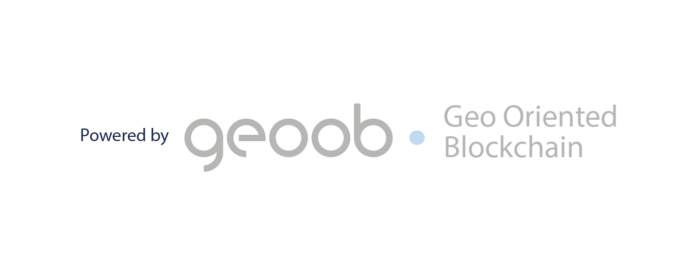

<p align="center">
  
</p>

<p align="center">
  
</p>

---

# Blue Identy Agents AI  
### GeoOBCode Core API — v0.1.0

**Blue Identy Agents AI** é uma camada de **agentes cognitivos aplicados à identidade, governança e integridade de processos**, construída sobre o **GeoOBCode Core API**.

Este repositório representa o **núcleo estrutural** da tecnologia, voltado à **codificação, selagem e verificação determinística de estados e eventos**, com foco em ambientes corporativos, regulados e de longo horizonte.

> Este projeto **não é um chatbot**, **não é um produto de engajamento** e **não é um repositório de documentos**.  
> Ele é **infraestrutura base**, projetada para robustez, auditabilidade e continuidade.

---

## Origem, Linhagem e Autoria

- **Autor / Base Cognitiva**: **PIRESAAO**
- **Baseline Técnico**: *PIRESAAO AgentIA Hub (FastAPI)*
- **Commit de origem**:  
  `chore: initialize GeoOBCode API from PIRESAAO AgentIA Hub Baseline`

A base de conhecimento, os princípios arquiteturais e a visão sistêmica são **pessoais (PIRESAAO)**, porém seguem **caminhos tecnológicos distintos e intencionais**, sendo que a separação entre esses caminhos é **estratégica, deliberada e permanente**.

---

## O que é o GeoOBCode

O **GeoOBCode** é um **framework de codificação orientado a espaço, estado e processo**, que permite:

- representar **eventos, decisões e estados** como estruturas verificáveis,
- separar explicitamente **fatos, hipóteses e inferências**,
- gerar **provas de execução e de processo**, não apenas de documentos,
- sustentar **governança, auditoria, reversibilidade e continuidade**.

Ele pode operar:

- **off-chain**, como infraestrutura determinística,
- **ancorado criptograficamente**, quando fizer sentido,
- **interoperável** com outros sistemas (ex.: Geotoken Engine).

---

## Princípios Arquiteturais

Este projeto é guiado por princípios explícitos:

- **Estado explícito > memória implícita**
- **Contratos formais > prompts heurísticos**
- **Determinismo onde importa**
- **Separação entre conteúdo e integridade**
- **Evolução incremental, sem reescrita**
- **Infraestrutura antes de produto**

O foco é **engenharia de sistemas**, não demonstração superficial.

---

## Arquitetura do Projeto

Estrutura herdada e preservada do baseline técnico, por ser **neutra e reutilizável**:

```text
app/
 ├─ api/        # Contratos HTTP (PoC)
 ├─ core/       # Configuração, segurança, governança
 ├─ services/   # Codificação, validação, selagem
 ├─ infra/      # Persistência local (PoC)
 └─ domain/     # Schemas e contratos tipados

assets/
 └─ branding/   # Identidade visual (logos)
````

---

## Status Atual

**Versão:** `0.1.0`
**Estado:** PoC funcional, infraestrutura validada

✔ FastAPI operacional
✔ Contratos de API definidos
✔ Persistência local (JSON) para validação de fluxo
✔ Linhagem técnica preservada
⏳ Implementação específica dos conceitos GeoOBCode (em evolução)

---

## O que este repositório NÃO é

* ❌ Não é um chatbot
* ❌ Não é um sistema de agentes autônomos genéricos
* ❌ Não é um CMS ou data lake
* ❌ Não é um produto final de interface

Ele é **o núcleo** sobre o qual produtos e aplicações podem ser construídos.

---

## Roadmap Conceitual (alto nível)

### Fase 1 — Núcleo Estrutural

* Definição formal de **Case / Cell / Seal**
* Codificação determinística de estados
* Versionamento e integridade

### Fase 2 — Governança e Prova

* Trilhas de eventos (event sourcing)
* Verificação, consistência e reversibilidade
* Delimitação semântica explícita

### Fase 3 — Interoperabilidade

* Integração opcional com Geotoken Engine
* Selagem visual (GeoOBCode)
* Ancoragem criptográfica quando aplicável

---

## Execução Local (PoC)

### Requisitos

* Python **3.11.x** (recomendado)

### Ambiente virtual

```bash
python -m venv .venv
source .venv/bin/activate  # Linux/macOS
# ou
.venv\Scripts\Activate.ps1 # Windows
```

### Instalação de dependências

```bash
pip install -r requirements.txt
```

### Subir a API

```bash
uvicorn app.main:app --reload
```

Swagger / OpenAPI:

```
http://127.0.0.1:8000/docs
```

---

## Nota Final

O **GeoOBCode** é uma tecnologia pensada para **horizonte longo**, com baixa dívida técnica e alto rigor conceitual.

Ele compartilha **origem intelectual** com outros projetos do ecossistema PIRESAAO,
mas **não compartilha destino**.

---

© PIRESAAO — todos os direitos reservados
